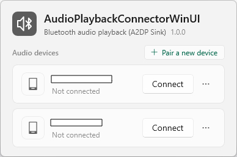
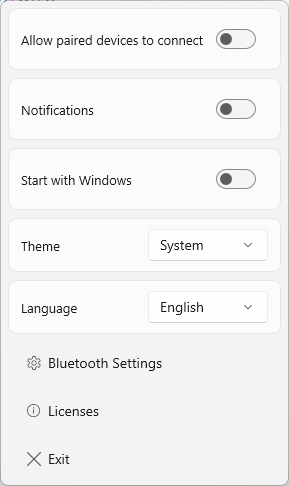

# AudioPlaybackConnectorWinUI

**English** | [简体中文](./README.zh_CN.md)

Bluetooth audio receiver (A2DP Sink) connection tool for Windows 10/11.

Note: this project is a refactor of [ysc3839/AudioPlaybackConnector](https://github.com/ysc3839/AudioPlaybackConnector).

## Preview





## Usage

* Download the file that matches your machine from [releases](../../releases) and run it.

  | File | Architecture | Also needs |
  | --- | --- | --- |
  | `AudioPlaybackConnectorWinUI-x64-SelfContained.exe` | x64 | nothing |
  | `AudioPlaybackConnectorWinUI-x64-FrameworkDependent.exe` | x64 | Windows App Runtime 2.5.1 |
  | `AudioPlaybackConnectorWinUI-ARM64-SelfContained.exe` | ARM64 | nothing |
  | `AudioPlaybackConnectorWinUI-ARM64-FrameworkDependent.exe` | ARM64 | Windows App Runtime 2.5.1 |

  The self-contained file packs the Windows App SDK into the one file;

  The framework-dependent file uses the runtime already installed on the machine.

* **Left click** the notification-area icon to open the device panel and connect or disconnect a Bluetooth audio device.

* **Right click** the icon for the context menu: allow paired devices to connect, notifications, start with Windows, theme, language, and then Bluetooth settings, Licenses and Exit.

* **Allow paired devices to connect**, while it is on, lets the connection be started from the already paired device's side.

* **Notifications**, while it is on, shows a short message through the notification-area icon when the application is ready, when a device connects and when a device disconnects.

* Every device's card in the panel has an **ellipsis** button at its trailing edge, which opens that device's own **reconnect on next start** switch and its **delete device** button.

* The **theme** setting switches between the light and the dark theme.

* The **language** setting switches the language the interface is shown in.

* Devices are listed automatically; add a new one in Bluetooth settings first.

## Main changes in the refactor

* **Fluent Design**

* **Windows App SDK 2.5.1 / WinUI 3**

  `Windows.UI.Xaml.Hosting.DesktopWindowXamlSource` (UWP XAML Islands) is gone;
  the interface is hosted in a real WinUI 3 window carrying `Microsoft.UI.Xaml`.

* **Single instance only**

* **Start with Windows switch**

* **A notification at startup**

* **Allow paired devices to connect**

* **Toolchain**

  C++/WinRT 3.0, WIL 1.0.260126.7, Windows SDK 10.0.26100, toolset v145
  (falls back to v143 on Visual Studio 2022), C++20.

* **A tray popup panel instead of the UWP `DevicePicker`**

  WinUI 3 has no replacement for the UWP `DevicePicker`. Devices are now
  enumerated through the `AudioPlaybackConnection` device selector and drawn by
  the application itself.

## Requirements

* Windows 10 version 2004 (build 19041) or later, x64 or ARM64

* A Bluetooth adapter that supports the A2DP Sink role

* The **framework-dependent** files need **Windows App Runtime 2.5.1 [x64](https://aka.ms/windowsappsdk/2.5/2.5.1/windowsappruntimeinstall-x64.exe) / [ARM64](https://aka.ms/windowsappsdk/2.5/2.5.1/windowsappruntimeinstall-arm64.exe)** installed

## Single-file packaging

A WinUI 3 application cannot be compiled into a single file as it stands: the
Windows App SDK binaries and the compiled XAML resource index both have to exist
on disk as real files.

The project therefore carries a tiny dependency-free launcher
(`launcher/Launcher.vcxproj`, statically linked C runtime, no reference to the
Windows App SDK), with one of the two payloads appended to it:

* On first run the launcher unpacks the payload into
  `%LOCALAPPDATA%\AudioPlaybackConnectorWinUI\app\<payload ID>\` and starts the
  real program from there; later runs start it directly without unpacking.

* A framework-dependent payload contains only the application and
  `Microsoft.WindowsAppRuntime.Bootstrap.dll`, and the bootstrap library locates
  the runtime already installed on the machine.

* The payload ID is derived from the payload contents, so replacing the file with
  a new build unpacks into a new directory, and directories left behind by older
  versions are cleaned up.

## Diagnostics

The application has no network code: it never sends anything anywhere, and it
collects no usage data.

It keeps two files in the directory it runs from:

* `AudioPlaybackConnectorWinUI.log`. Failures.

  Setting the environment variable `APC_TRACE=1` additionally records trace logs
  of the popups and the connection flows. The log names the relevant Bluetooth
  devices, and the device id that carries the Bluetooth address, but it is never
  uploaded, and deleting it at any time is safe.

* `AudioPlaybackConnectorWinUI.json`. The settings: the theme, the language, the
  receiver and notification switches, and the devices to reconnect on the next
  launch.

## Building from source

Requirements: Visual Studio 2022 (17.x) or 2026 with the **Desktop development with
C++** workload, the **Windows 11 SDK 10.0.26100**, and Python 3 on `PATH`. The project
targets toolset v145 and falls back to v143 on Visual Studio 2022; the WinUI 3
component packages are referenced directly rather than through the aggregate Windows
App SDK package, so only what a notification-area utility needs is carried
(`AudioPlaybackConnectorWinUI.vcxproj`).

```powershell
# One distribution: architecture crossed with deployment model.
pwsh tools/build-single-file.ps1 -Platform x64 -Deployment SelfContained

# The four files of a release.
pwsh tools/build-single-file.ps1 -Platform x64   -Deployment SelfContained
pwsh tools/build-single-file.ps1 -Platform x64   -Deployment FrameworkDependent
pwsh tools/build-single-file.ps1 -Platform ARM64 -Deployment SelfContained
pwsh tools/build-single-file.ps1 -Platform ARM64 -Deployment FrameworkDependent
```

Each writes `dist\<Platform>\AudioPlaybackConnectorWinUI-<Platform>-<Deployment>.exe`
together with the two licence files that have to travel with it. Opening
`AudioPlaybackConnectorWinUI.sln` builds the same projects in the IDE, without
packaging.

Two generated inputs are committed, and each has its own script:

* `translate/generated/*` is produced from `translate/source/*.po` by
  `sh translate/gen_rc.sh` (a POSIX shell; the CI runs it from Git Bash). Adding or
  changing a user-visible string also means regenerating `translate/source/messages.pot`,
  which needs GNU gettext: `sh translate/gen_pot.sh`.
* The version lives in the two resource scripts and the two manifests. Bump all four
  at once with `pwsh tools/set-version.ps1 -Version x.x.x` and check them with
  `pwsh tools/set-version.ps1 -Verify`. The CI stamps a tag's version before packaging
  and fails a tag whose version files disagree.

## License

This project is a derivative work of [ysc3839/AudioPlaybackConnector](https://github.com/ysc3839/AudioPlaybackConnector), and are released under the same MIT licence.

The licence texts:

* [`LICENSE`](LICENSE) in the repository

* [`tools/THIRD-PARTY-NOTICES.txt`](tools/THIRD-PARTY-NOTICES.txt), which is the single
  source of the component description. `tools/assemble-third-party-notices.ps1` takes
  that file as it stands, appends the licence and notice text of every redistributed
  NuGet package, and writes the assembled text to the repository root as
  `THIRD-PARTY-NOTICES.txt` together with an MSZIP stream of it as
  `THIRD-PARTY-NOTICES.compressed`. That runs before the application is compiled (from
  `tools/build-single-file.ps1`), so the resource script embeds the compressed stream
  as RCDATA (301) and the packaging script copies the assembled text beside the
  executable.

* Next to every released file, written by the packaging script:

  | File | Contents |
  | --- | --- |
  | `LICENSE.txt` | The full MIT licence |
  | `THIRD-PARTY-NOTICES.txt` | Describes the bundled components, followed by the full Microsoft Windows App SDK license terms and the notices for the open-source components inside it |

* Inside the program: **right click the tray icon, then Licenses**. The dialog shows the
  licence and the notices compiled into the executable (RCDATA 300 and 301, the notices
  stored MSZIP compressed and decompressed in memory). The complete notice text is about
  890,000 characters and a `TextBlock` that laid all of it out would block the UI thread,
  so the dialog shows the beginning of it and states how long the whole text is and that
  the program carries all of it.

The runtime packed into the program is not covered by this project's MIT licence.

The self-contained build carries the binaries binplaced by the WindowsAppSDK
NuGet packages, and the framework-dependent build carries
`Microsoft.WindowsAppRuntime.Bootstrap.dll`;

section 3(a)(i) of the [Microsoft Software License Terms for the Microsoft Windows App SDK](https://www.nuget.org/packages/Microsoft.WindowsAppSDK.Runtime/2.5.1/license)
permits redistributing those files, but they stay under Microsoft's terms, and
those terms do not allow removing or modifying Microsoft's notices.

C++/WinRT and the Windows Implementation Library are MIT licensed (copyright
Microsoft); both are header-only and no binary of either is redistributed. Their
notices are reproduced in full in `THIRD-PARTY-NOTICES.txt`.

None of these licences grant trademark rights, and this project is not affiliated
with, sponsored by, or endorsed by Microsoft or by Richard Yu.
