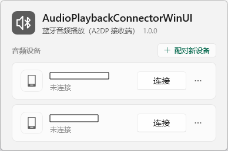
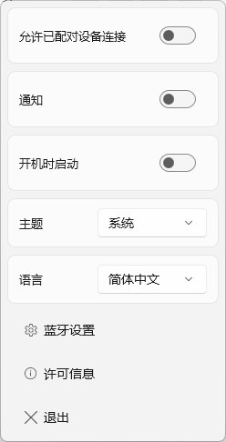

# AudioPlaybackConnectorWinUI

[English](./README.md) | **简体中文**

Windows 10/11 蓝牙音频接收 (A2DP Sink) 连接工具。

此项目是基于 [ysc3839/AudioPlaybackConnector](https://github.com/ysc3839/AudioPlaybackConnector) 的重构。

## 预览





## 使用方法

* 从 [releases](../../releases) 下载与你的机器匹配的文件并运行。

  | 文件 | 架构 | 额外要求 |
  | --- | --- | --- |
  | `AudioPlaybackConnectorWinUI-x64-SelfContained.exe` | x64 | 无 |
  | `AudioPlaybackConnectorWinUI-x64-FrameworkDependent.exe` | x64 | Windows App Runtime 2.5.1 |
  | `AudioPlaybackConnectorWinUI-ARM64-SelfContained.exe` | ARM64 | 无 |
  | `AudioPlaybackConnectorWinUI-ARM64-FrameworkDependent.exe` | ARM64 | Windows App Runtime 2.5.1 |

  自包含（SelfContained）文件把 Windows App SDK 一并装进一个文件；

  非自包含（FrameworkDependent）文件使用机器上已经安装的运行时。

* **左键点击** 托盘图标，打开设备面板并连接或断开蓝牙音频设备。

* **右键点击** 图标打开右键菜单：允许已配对设备连接、通知、开机时启动、主题、语言，
  以及蓝牙设置、许可信息与退出。

* **允许已配对设备连接** 打开时，可以从已配对的设备端建立连接。

* **通知** 打开时，程序就绪、设备连接和设备断开都会通过托盘图标显示一条简短提示。

* 面板里每个设备的卡片末尾都有一个 **省略号** 按钮，展开后是该设备自己的 **下次启动时重新连接** 开关
  以及 **删除设备** 按钮。

* **主题** 设置可以切换亮/暗色主题。

* **语言** 设置可以切换显示语言。

* 设备会自动列出；新设备请先在蓝牙设置中添加。

## 重构主要变化

* **Fluent Design 设计**

* **Windows App SDK 2.5.1 / WinUI 3**

  移除了 `Windows.UI.Xaml.Hosting.DesktopWindowXamlSource`（UWP XAML Islands），
  界面改为在真正的 WinUI 3 窗口中承载 `Microsoft.UI.Xaml`。

* **仅允许单实例启动**

* **开机启动开关**

* **启动时通知**

* **允许已配对设备连接**

* **工具链**

  C++/WinRT 3.0、WIL 1.0.260126.7、Windows SDK 10.0.26100、
  工具集 v145（Visual Studio 2022 回退到 v143）、C++20。

* **用托盘弹出面板替代 UWP `DevicePicker`**

  WinUI 3 没有 UWP `DevicePicker` 的替代品。现在直接通过
  `AudioPlaybackConnection` 设备选择器枚举设备并由程序自行绘制。

## 系统要求

* Windows 10 版本 2004（内部版本 19041）或更高，x64 或 ARM64

* 支持 A2DP Sink 角色的蓝牙适配器

* **非自包含**文件需要安装 **Windows App Runtime 2.5.1 [x64](https://aka.ms/windowsappsdk/2.5/2.5.1/windowsappruntimeinstall-x64.exe) / [ARM64](https://aka.ms/windowsappsdk/2.5/2.5.1/windowsappruntimeinstall-arm64.exe)**

## 单文件打包说明

WinUI 3 程序本身无法直接编译成单个文件：
Windows App SDK 的二进制文件与编译后的
XAML 资源索引都必须以真实文件存在于磁盘上。

因此本项目带一个极小的无依赖启动器（`launcher/Launcher.vcxproj`，
静态链接 C 运行时，不引用 Windows App SDK），并把两种负载之一附加到其中：

* 首次运行时，启动器把负载解压到
  `%LOCALAPPDATA%\AudioPlaybackConnectorWinUI\app\<负载 ID>\`，然后从那里启动真正的程序；
  之后的运行直接启动，不再解压。

* 非自包含负载只包含程序本体与 `Microsoft.WindowsAppRuntime.Bootstrap.dll`，
  由引导库去定位机器上已安装的运行时。

* 负载 ID 由负载内容计算得出，因此替换为新的构建会自动解压到新目录，
  旧版本遗留的目录会被自动清理。

## 诊断信息

程序没有任何网络代码，不会向任何地方发送数据，也不收集使用信息。

它会在自己所在的目录中保留两个文件。

* `AudioPlaybackConnectorWinUI.log`：失败信息。

  设置环境变量 `APC_TRACE=1` 会额外记录弹窗与连接流程的跟踪日志。
  日志中会出现相关蓝牙设备的名称，以及包含蓝牙地址的设备 ID，但它不会被上传，可随时删除。

* `AudioPlaybackConnectorWinUI.json`：设置持久化（主题、语言、接收端与通知开关，以及需要重新连接的设备）。

## 从源码构建

需要 Visual Studio 2022（17.x）或 2026，安装 **使用 C++ 的桌面开发** 工作负载、**Windows 11 SDK 10.0.26100**，并在 `PATH` 中提供 Python 3。项目使用 v145 工具集，在 Visual Studio 2022 上回退到 v143；WinUI 3 各组件包是直接引用的，而不是通过 Windows App SDK 聚合包，因此只携带托盘工具真正需要的内容（见 `AudioPlaybackConnectorWinUI.vcxproj`）。

```powershell
# 单次构建：架构 × 部署方式
pwsh tools/build-single-file.ps1 -Platform x64 -Deployment SelfContained

# 一次发布的四个文件
pwsh tools/build-single-file.ps1 -Platform x64   -Deployment SelfContained
pwsh tools/build-single-file.ps1 -Platform x64   -Deployment FrameworkDependent
pwsh tools/build-single-file.ps1 -Platform ARM64 -Deployment SelfContained
pwsh tools/build-single-file.ps1 -Platform ARM64 -Deployment FrameworkDependent
```

每个命令输出 `dist\<Platform>\AudioPlaybackConnectorWinUI-<Platform>-<Deployment>.exe`，以及必须随附的两个许可文件。用 `AudioPlaybackConnectorWinUI.sln` 可在 IDE 中构建同样的项目（不含打包）。

有两个生成物需要提交，各自都有生成脚本：

* `translate/generated/*` 由 `translate/source/*.po` 通过 `sh translate/gen_rc.sh` 生成（需要 POSIX shell，CI 使用 Git Bash）。新增或修改用户可见字符串时还要重新生成 `translate/source/messages.pot`，这需要 GNU gettext：`sh translate/gen_pot.sh`。
* 版本号分布在两个资源脚本和两个清单文件中。用 `pwsh tools/set-version.ps1 -Version x.x.x` 一次性更新这四处，用 `pwsh tools/set-version.ps1 -Verify` 校验。CI 会在打包前按标签写入版本，并在版本文件不一致时失败。

## 许可

本项目是 [ysc3839/AudioPlaybackConnector](https://github.com/ysc3839/AudioPlaybackConnector)
的衍生作品，并以相同的 MIT 许可发布。

许可文本：

* 仓库 [`LICENSE`](LICENSE)

* [`tools/THIRD-PARTY-NOTICES.txt`](tools/THIRD-PARTY-NOTICES.txt)，组件说明唯一来源。
  `tools/assemble-third-party-notices.ps1` 以该文件为准，把每个再分发 NuGet 包自身的许可与声明文本追加到它后面，
  并把拼装后的文本写入仓库根目录的 `THIRD-PARTY-NOTICES.txt`，同时写出它的 MSZIP 压缩流
  `THIRD-PARTY-NOTICES.compressed`。这一步在编译程序之前执行（由 `tools/build-single-file.ps1` 调用），
  因此资源脚本嵌入的 RCDATA (301) 是压缩流，而打包脚本把拼装后的文本复制到可执行文件旁。

* 每个发布文件旁，由打包脚本写入：

  | 文件 | 内容 |
  | --- | --- |
  | `LICENSE.txt` | MIT 许可全文 |
  | `THIRD-PARTY-NOTICES.txt` | 说明所打包的组件，后接 Microsoft Windows App SDK 许可条款全文，以及其内置开源组件的声明。 |

* 程序内部：**右键菜单-许可信息**。对话框显示的是编译进可执行文件的许可与声明（RCDATA 300 和 301，
  声明以 MSZIP 压缩存放、在内存中解压）。
  声明全文约 89 万字符，若让 `TextBlock` 全部排版会阻塞 UI 线程，所以对话框只显示开头部分，
  并注明全文总长度以及完整文本已编译进程序。

打包进程序的运行时不受本项目 MIT 许可约束。

自包含版本携带 WindowsAppSDK NuGet 包 binplace
的二进制文件，框架依赖版本携带 `Microsoft.WindowsAppRuntime.Bootstrap.dll`；
[Microsoft Windows App SDK 软件许可条款](https://www.nuget.org/packages/Microsoft.WindowsAppSDK.Runtime/2.5.1/license)
第 3(a)(i) 节允许再分发这些文件，但它们仍受 Microsoft 条款约束，且该条款不允许删除或修改
Microsoft 的声明。

C++/WinRT 与 Windows Implementation Library 为 MIT 许可（Microsoft），两者均为仅头文件库，
不随程序再分发任何二进制文件。其声明全文已收录在 `THIRD-PARTY-NOTICES.txt` 中。

以上许可均不授予商标权，本项目与 Microsoft 及 Richard Yu 无隶属关系，也未获得其赞助或认可。
